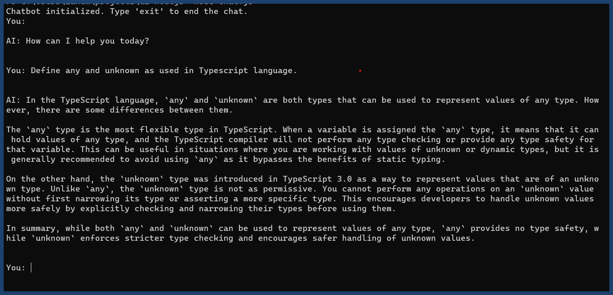
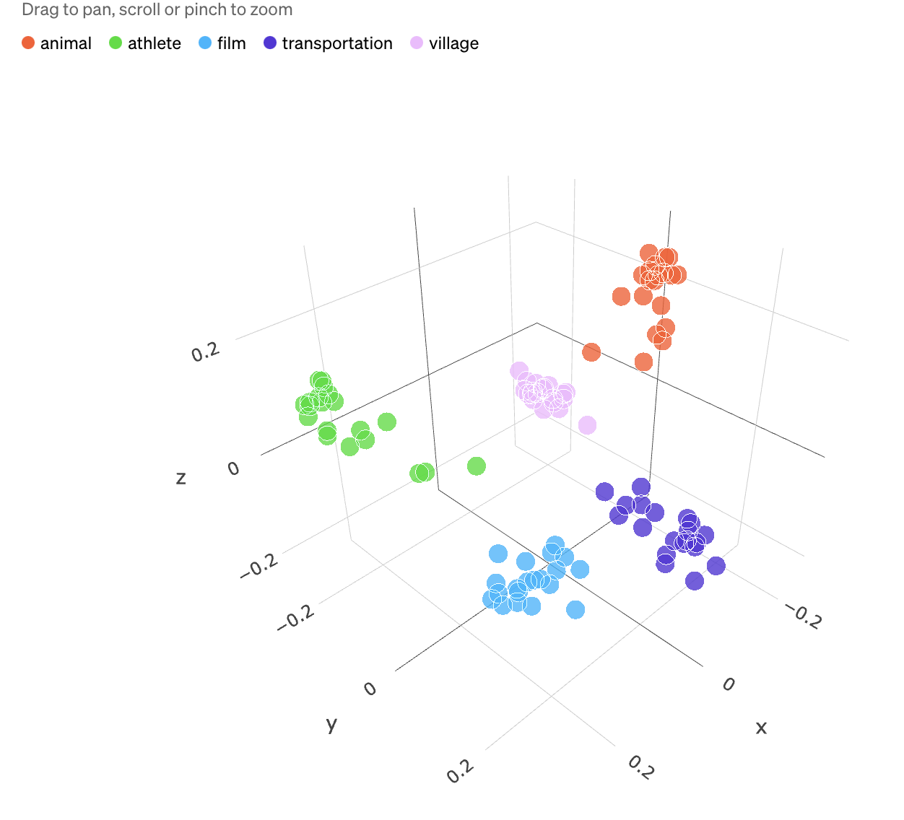
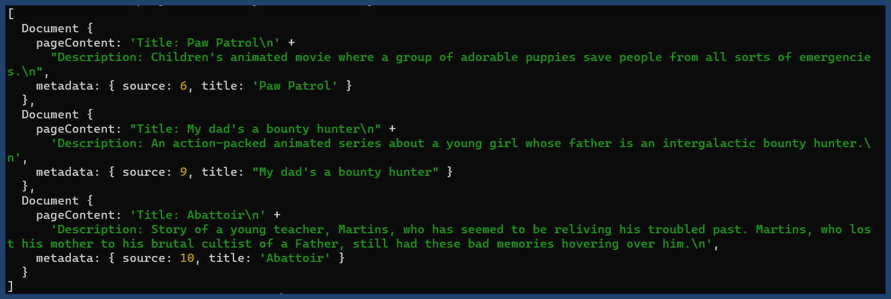
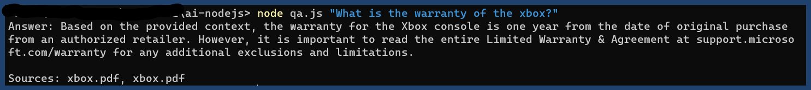

## AI APPLICATION WITH NODE.JS

This project files demonstrates the use of Node.js to create an AI application for various use-cases, such as:

- Chat experiences
- Embeddings and vector stores
- Semantic search
- Document QA
- Function Calling
- And more!

## Getting Started

### Prerequisites

- [Node.js](https://nodejs.org/en/download/) version 20+.
- [Bun](https://bun.sh/) version 1.0+.
- OpenAI API key. You can get one [here](https://platform.openai.com/).

## Project 1: Chat Experiences [chat.js]

### Overview

Integrating LLMs into chat experiences can be a great way to improve the user experience.

Remember those old chatbots that would just spit out a random response or only a handful of questions? Well, now you can use LLMs to generate responses that are more relevant to the conversation.

They can understand the context of the conversation and generate responses that are more relevant to the conversation.

### How it works

> Initialize the OpenAI API client with your API key

```JavaScript

const openai = new OpenAI({
  apiKey: process.env.OPENAI_API_KEY,
})

```

> Message Handling

```JavaScript
const newMessage = async (history, message) => {
  const chatCompletion = await openai.chat.completions.create({
    messages: [...history, message],
    model: 'gpt-3.5-turbo',
  })

  return chatCompletion.choices[0].message
}
```

This code sets up a simple chatbot in the terminal using OpenAI's GPT-3.5 Turbo model. The user types in questions or statements, and the AI responds accordingly. The chat maintains a history of interactions to provide context for the AI's responses.

`node chat.js`



## Project 2: Semantic search [search.js]

### Overview

Unlike traditional search engines, semantic search engines don't just look for keywords in a document. They look for the meaning of the document and try to find documents that are similar in meaning.

This is enabled by the concept of embeddings. Embeddings are a way to represent words and documents as vectors in a high-dimensional space. Similar words and documents are closer together in this space.

Semantic search tries to understand the intent behind the query. It's not just about the words you use, but the meaning behind them.



### How it works

> Imports

```JavaScript
import 'dotenv/config'
import { Document } from 'langchain/document'
import { MemoryVectorStore } from 'langchain/vectorstores/memory'
import { OpenAIEmbeddings } from 'langchain/embeddings/openai'

```

- `dotenv/config`: Loads environment variables from a `.env` file.
- `langchain/document`: Imports the `Document` class, used to structure data for vector indexing.
- `langchain/vectorstores/memory`: Imports the `MemoryVectorStore`, an in-memory storage for vectors (semantic representations of data).
- `langchain/embeddings/openai`: Imports the `OpenAIEmbeddings`, which interfaces with OpenAI to obtain semantic embeddings for data.

> Create Store Function

```JavaScript

const createStore = () =>
  MemoryVectorStore.fromDocuments(
    movies.map(
      (movie) =>
        new Document({
          pageContent: `Title: ${movie.title}\n${movie.description}`,
          metadata: { source: movie.id, title: movie.title },
        })
    ),
    new OpenAIEmbeddings()
  )

```

> Search Function

```JavaScript
export const search = async (query, count = 1) => {
  const store = await createStore()
  return store.similaritySearch(query, count)
}
```

> Execute a search

```JavaScript
console.log(await search('For kids...'))
```

`node search.js`



## Project 3: Document QA [qa.js]

### Overview

Here you feed your document(s) and question(s) to the LLM. It processes the content, understands the context, and generates a concise answer.

### How it works

We'll create a simple QA chat bot that indexes a PDF and a Youtube video transcript as it's knowledge base.

> Setting up variables

```JavaScript
const question = process.argv[2] || 'hi'
const video = `https://youtu.be/zR_iuq2evXo?si=cG8rODgRgXOx9_Cn`

```

- `question`: Grabs the first command-line argument as the question to be queried. If none is provided, defaults to 'hi'.
- `video`: Defines a YouTube video URL.

> Load and split Youtube video text

```JavaScript
export const docsFromYTVideo = async (video) => {
  const loader = YoutubeLoader.createFromUrl(video, {
    language: 'en',
    addVideoInfo: true,
  })
  return loader.loadAndSplit(
    new CharacterTextSplitter({
      separator: ' ',
      chunkSize: 2500,
      chunkOverlap: 100,
    })
  )
}

```

This function takes a YouTube video URL, loads its content, and splits it into manageable chunks. It uses `YoutubeLoader` to fetch the video's content and `CharacterTextSplitter` to divide the content.

> Load combined Document store

```JavaScript
const loadStore = async () => {
  const videoDocs = await docsFromYTVideo(video)
  const pdfDocs = await docsFromPDF()

  return createStore([...videoDocs, ...pdfDocs])
}
```

This function combines the chunks from the YouTube video and the PDF, creating a combined memory vector store.

> Query Function

```JavaScript
const query = async () => {
  const store = await loadStore()
  const results = await store.similaritySearch(question, 2)

  const response = await openai.chat.completions.create({
    model: 'gpt-3.5-turbo-16k-0613',
    temperature: 0,
    messages: [
      {
        role: 'assistant',
        content:
          'You are a helpful AI assistant. Answser questions to your best ability.',
      },
      {
        role: 'user',
        content: `Answer the following question using the provided context. If you cannot answer the question with the context, don't lie and make up stuff. Just say you need more context.
        Question: ${question}

        Context: ${results.map((r) => r.pageContent).join('\n')}`,
      },
    ],
  })
  console.log(
    `Answer: ${response.choices[0].message.content}\n\nSources: ${results
      .map((r) => r.metadata.source)
      .join(', ')}`
  )
}
```

> Execute a query

`query()`

`node search.js`



## Project 4: Function Calling [function.js]

### Overview

While LLMs can't actively browse the internet, they can be used in tandem with function calls to other systems that can. Essentially, the LLM instructs another system to perform a specific task and then uses that data in its response.

Hence, one can tailor which functions or services the LLM can call, allowing for a cutomized user experience.

### How it works

> Imports

```JavaScript
import 'dotenv/config'
import { openai } from './openai.js'
import math from 'advanced-calculator'
const QUESTION = process.argv[2] || 'hi'
```

> Completion Function

```JavaScript
const getCompletion = async (messages) => {
  const response = await openai.chat.completions.create({
    model: 'gpt-3.5-turbo-0613',
    messages,
    functions: [
      {
        name: 'calculate',
        description: 'Run a math expression',
        parameters: {
          type: 'object',
          properties: {
            expression: {
              type: 'string',
              description:
                'Then math expression to evaluate like "2 * 3 + (21 / 2) ^ 2"',
            },
          },
          required: ['expression'],
        },
      },
    ],
    temperature: 0,
  })

  return response
}

```

`node function.js`


